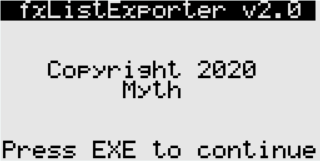
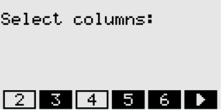
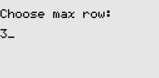
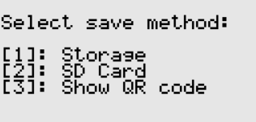
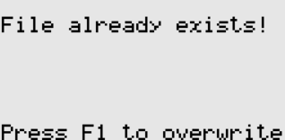

## 前言

在我做大学物理实验时，需要记录很多数据。我习惯用计算器的 LIST 功能记录这些数据。可是 fx-9860 系列导出数据有一定困难，需要 Mini USB 线缆。因此，萌生了通过二维码导出 LIST 数据的想法。这样，fxListExporter 诞生啦！

## 功能

+ 选择需要的行和列
+ 将 CSV 文件保存在计算器内存或 SD 卡中
+ 使用二维码导出数据
+ double 精度
+ 支持科学计数法
 
## 使用方法

1. 打开程序，按下 EXE
2. 通过 F1~F6 选择所需要的列。按下 EXE 继续
3. 输入要获取的最大行。比如输入 3，就是获取 1~3 行。按下 EXE 继续
4. 选择导出方式。按 1 保存 CSV 到内存；按 2 保存 CSV 到 SD 卡；按 3 通过二维码显示数据
5. 如选择 1 或 2，可能会遇到已存在 CSV 文件的情况。此时可按 F1 覆盖文件
6. 如选择 3，此时显示二维码。若未显示二维码，说明选取的数据过多

## 程序截图

## 感谢

感谢 [flaribbit](https://github.com/flaribbit) 的二维码库 [FxQr](https://github.com/flaribbit/FxQr)

## 已知问题

+ 导出过大的 CSV 文件时，可能发生崩溃
+ 不能使用二维码展示过多的 LIST 数据。若数据过多，不会显示二维码。考虑未来通过分割 CSV 解决
 
## 开源地址

[https://github.com/Mythologyli/fxListExporter](https://github.com/Mythologyli/fxListExporter)

如果你喜欢本程序的话，欢迎去点一个 Star 哦！

## 实现原理

在编写程序的过程中，如何获取 LIST 的数据是最令我困惑的一点

大体的实现思路是利用 syscall 中的 CalculateExpression 函数计算 LISTM[N] 的值，然后在通过对 BCD 编码的转换得到 double 数据


// Get List col[row] in double format
// If no data in that grid, return NULL
double *GetList(int col, int row)
{
    TBCDvalue *bcd_value = (TBCDvalue *)malloc(sizeof(TBCDvalue)); // TBCDvalue format result
    double *double_value = (double *)malloc(sizeof(double)); // double value
    // Calculate expression: Listcol[row]
    char *expression = (char *)calloc(10, sizeof(char));
    char position[4]; // store col/row
    char bracket[2] = {0x5B, '\0'}; // store "[" and "]"
    // "List"
    expression[0] = 0x7F; // first part of "List"
    expression[1] = 0x51; // second part of "List"
    // col
    itoa(col, position);
    strcat(expression, position);
    // "["
    strcat(expression, bracket);
    // row
    itoa(row, position);
    strcat(expression, position);
    // "]"
    bracket[0] = 0x5D;
    strcat(expression, bracket);
    char opcode[2] = {1, 0};
    int mode = 1;
    // Get the result of List col[row] in BCD format
    // CalculateExpression() return 0 means no data in that grid
    if (!CalculateExpression(&expression, opcode, bcd_value, mode))
       return NULL;
    // Convert result to double format 
    TBCD *bcd = new TBCD;
    bcd->Set(*bcd_value);
    bcd->Get(*double_value);
    delete bcd;
    free(bcd_value);
    return double_value;
}


可以通过这个 demo 理解。

## 下载地址

[点击此链接](https://cloud.akashic.cc/#s/6EcqHrhQ)

## 注意事项

如果是新 9860（SH4），请下载 LISTEXP_SH4.g1a。下载后重命名为 LISTEXP.g1a，再导入计算器