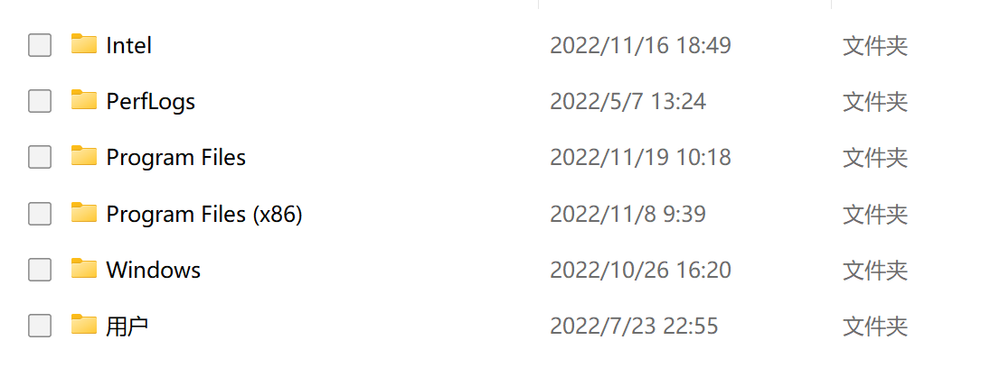

## 故障

微软至少在 Windows 10 就引入了平板模式。平板模式为触摸屏设备（如笔者的 Surface）进行了优化，提升了使用这些设备的体验。例如，UI 间距变大、资源管理器出现复选框等等。当然，在使用键鼠时，这些特性只会帮倒忙。

在 Windows 10，微软至少提供了一个开关在平板模式和普通模式之间切换。但在 Windows 11 中，聪明的微软让平板模式变得更强制了。例如，对于 Surface，只要没有接入 Surface 键盘，都会自动进入平板模式，且无法退出。更神奇的是，即使接入外置键盘也不行——微软依旧认为你应该使用平板模式。

平板模式在 Windows 11 中带来了不可关闭的资源管理器复选框，非常烦人。Chrome 等应用也变得肥大。

在 Microsoft Community 和 Reddit 上已经有不少人抱怨此事，反馈中心也有相关的反馈。但微软似乎不是很在意。并且，找了半天也没有能成功退出平板模式的方法。于是我只好自己研究一下。

## 解决方案

解决方案倒是异常简单，只需要在注册表中改变一个键值。很奇怪，Microsoft Community 和 Reddit 上居然没人说。

我先查找了微软关于平板模式的文档：

https://learn.microsoft.com/en-us/windows-hardware/design/device-experiences/continuum

这个文档大概是面向驱动程序开发人员的，其中提到：

> There are two main ways to enter/exit “tablet mode”:
>
> + Manually - The user can enter/exit “tablet mode” manually by pressing the “tablet mode” button located in Action Center.
> + Hardware action triggered - The OS can ask the user if they would like to enter/exit “tablet mode” if the hardware has indicated the form factor has changed through ConvertibleSlateMode.

看来，通过 `ConvertibleSlateMode` 可以控制平板模式。同时，微软在 FAQ 中写道：

> Will the auto prompt to enter/exit “tablet mode” take place upon the insertion of an external USB keyboard?
>
> No, the auto prompt will be triggered through the toggling of the ConvertibleSlateMode value, not the presence of any kind of keyboard.

这下破案了，只要驱动程序不去更改 `ConvertibleSlateMode` 的值，就不会改变当前的模式。USB 键盘的驱动当然不会去改这个值了，难怪插入 USB 键盘也没用。

现在，解决方案就很明确了：将 `\HKEY_LOCAL_MACHINE\SYSTEM\CurrentControlSet\Control\PriorityControl` 中的 `ConvertibleSlateMode` 的值改为 `1` 即可。

我编写了一个注册表脚本去修改这个值：

https://gist.github.com/Mythologyli/78e0b2cba3541b3f7795236e4dabb999

    Windows Registry Editor Version 5.00

    [HKEY_LOCAL_MACHINE\SYSTEM\CurrentControlSet\Control\PriorityControl]
    "ConvertibleSlateMode"=dword:00000001

运行一下这个脚本，你的电脑就退出平板模式啦。