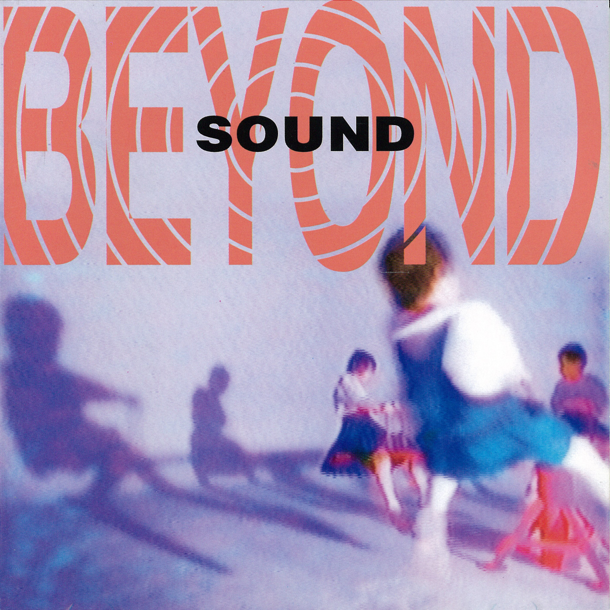

## 写在前面

从小学开始，听歌多年，自然也有许多很好的专辑想与大家分享。屡屡想下笔，却不知从何写起。每次听到好的专辑，激动地想要写一篇推荐，又发现实在是冷僻的要命，只得悻悻地将敲好的几个字删去了。毕竟不想大家点进来，看一眼，心生“这什么鬼玩意儿”的疑惑，然后再退出去。因此，还是从 Beyond 写起吧。

回想起来，Beyond 是我正经开始听歌听的第一支乐队。小学那时对这支乐队非常痴迷，几乎听过 Beyond 的每一首歌，能从头到尾背完 Beyond 发行的每一张专辑。我一直使用的网名 Myth，来自 Beyond 首专《再见理想》中的同名歌曲。其实现在打着这些文字，也非常感慨。小时听 Beyond 时，曾想过再过十年、二十年，是否还会再去听这一首首歌。现在戴着耳机写着这些，也有一种与过去的自己对话的感觉。

大家对 Beyond 的大多数印象，可能都来自于 Beyond 的主唱黄家驹，以及由他作曲的《海阔天空》、《光辉岁月》、《喜欢你》等超热门歌曲。不过今天想推荐的专辑，是黄家驹先生去世后，Beyond 三子时期推出的专辑 ——《Sound》。

成立于 1983 年的 Beyond 乐队，最为大家熟知的阵容是：主唱兼节奏吉他黄家驹、主音吉他黄贯中、贝丝黄家强、鼓手叶世荣。这段时期也被大家称为 Beyond 的“四子时期”。而 1993 年，主唱黄家驹先生在日本意外去世，乐队只能由黄贯中、黄家强、叶世荣三人苦苦支撑。但在这艰难的三子时期，Beyond 乐队却带来了许多质量极高的专辑，在我看来，在音乐性上甚至完成了对四子时期的超越。这些质量极高的专辑中，我最喜欢的便是今天想推荐给大家的《Sound》。

《Sound》发行于 1995 年 6 月，是三子时期乐队的第二张专辑。如果说第一张专辑《二楼后座》还有四子时期的影子，那《Sound》这张专辑已经彻底完成了 Beyond 的自我超越。这张专辑中，阿 Paul（黄贯中）、家强、世荣三人紧密的配合，也使这张专辑具有极佳的整体感。而在这之后，虽然乐队的音乐性仍在进步，但三人音乐想法的分歧、观点的差异，让专辑的拼接感越来越强，最终亦使乐队在十年后走到了尽头。某种程度上，《Sound》是一体的 Beyond 乐队的绝唱。

## 歌曲

**最推荐的几首：《Cryin'》、《阿博》、《门外看》、《声音》**

### 《铁马骝》

<audio controls preload="none" style="width: 100%;">
    <source src="mp3/1.01. 鐵馬騮 (演奏曲).mp3" type="audio/mp3" />
</audio>

鼓手叶世荣带来的 Drum Solo。世荣在乐队中的存在感其实一直不强，这也是难得的在专辑中 Solo 的机会。作为专辑的第一首歌，很舒服的节奏，不用多想，静静听即可，后面可就闹腾了。

### 《教坏细路》

<audio controls preload="none" style="width: 100%;">
    <source src="mp3/1.02. 教壞細路.mp3" type="audio/mp3" />
</audio>

    作词：Beyond
    作曲：Beyond
    演唱：黄家强

    不想再玩这游戏
    可否有点新的趣味
    歪曲是非没人理
    新闻最好带点趣味

    污糟邋遢 都争住播
    太失败 太荒谬
    整古做怪 诸多作做
    你一生 是这样

    你盏（点解）教坏细路
    脑袋注定发霉
    赈灾当做节目
    点解（认真）叫座叫好

简单地讲，骂 TVB 的歌。“教坏细路”，意思是教坏小孩。而“赈灾当做节目”，这都是 TVB 搞出过的荒唐事。发行之后，乐队便遭到了 TVB 的打压。

在这一首骂了 TVB，只是开胃菜，厉害的还在后面呢。

### 《缺口》

<audio controls preload="none" style="width: 100%;">
    <source src="mp3/1.03. 缺口.mp3" type="audio/mp3" />
</audio>

    作词：黄贯中
    作曲：黄贯中
    主唱：黄贯中

    一口呼喊声 然后踏进生命
    不懂得究竟 或某年某日 终于可清醒

    孤单的背影 谁愿共我清静
    几多哭笑声 伴我共上路多么的汹涌

    从没妥协纵有荆棘铺满着路途
    凝望这个永远修不到的缺口 无可补救

    有些声音 永远听不到
    纵会有色彩 但是漆黑将它都掩盖 在人海(里面)

    根生于四海 沉默地去等待
    千秋风雨改 但似未过问一刻的悲哀
    这一生也许 全为赎我的罪
    几多血汗水 没法尽抹掉心底的空虚

    有些家乡 永远去不到
    剩下了追忆 或是只得一些感应 梦魇着生命

阿 Paul 的作品，一如既往的高质量。在唱《大地》时嗓音清澈的阿 Paul，现在的嗓音已逐渐沧桑。

### 《阿博》

<audio controls preload="none" style="width: 100%;">
    <source src="mp3/1.04. 阿博.mp3" type="audio/mp3" />
</audio>

    作词：黄贯中
    作曲：黄贯中
    主唱：黄贯中

    我叫阿博 经已廿几
    人人在忙 但我最爱嬉戏
    个个说我 荒废自己
    人人自危 独我爱理不理

    所有说话我已经听够
    让理想消散如烟 管他今生会点

    因我的心情就有若微尘
    躺卧于街头或结伴同行
    也不介意做个自由人
    无必需要紧

    开始有点 讨厌自己
    旁人时常 话我欠缺生气
    讲起身家 总觉自卑
    茫茫前途 就似看见空气

    所有说话我已经听够
    让理想消散如烟 管他今生会点

    因我的心情就有若微尘
    躺卧于街头或结伴同行
    也不介意做个自由人
    无必需要紧

超推荐。

还是 Paul 的作品。“阿博”应是指 Paul 的一位好友。

哈哈，小时候果然听了个寂寞。“茫茫前途 就似看见空气”、“所有说话我已经听够 让理想消散如烟”，现在听起来，有些难受。

### 《Cryin'》

<audio controls preload="none" style="width: 100%;">
    <source src="mp3/1.05. Cryin'.mp3" type="audio/mp3" />
</audio>

    作词：黄家强
    作曲：黄家强
    主唱：黄家强

    夜还是一样
    路仍是一样
    未平伏的梦 亦一样

    在逃避孤独
    为谁在等待
    但无尽失落 在伤害

    困恼疑惑 生死好像竞赛
    慨叹短暂 一生愿快乐

    过去 你的心可有失落
    今天 创伤加添了无奈
    一生 遇上种种再不幸
    No more cryin' No more cryin'

    是明日的路
    尽情的虚度
    没期望一生 是怎样

    漫长夜的梦
    在蚕食空虚
    是无力的泪 在哀号

家强的作品，整张专辑最爱的一首。

前奏一上来就非常抓耳，适合闭着眼睛听。整首曲子，吉他和人声的配合完美，Paul 的 Solo、尾奏，两人的这些紧密配合，在之后的专辑里却再未出现，令人惋惜。

家强的作品里，这首我最喜欢。总有些人说“家强没什么本事”，我会好奇他们是否听过这一首。

### 《声音》

<audio controls preload="none" style="width: 100%;">
    <source src="mp3/1.06. 聲音.mp3" type="audio/mp3" />
</audio>

    作词：黄贯中
    作曲：黄贯中
    主唱：黄贯中

    这里规定 若有杂音必要管制
    雷声太大 像已是超出了天际

    谁可掩饰天裂地摇心底的呼叫

    太过响亮 是你未懂怎去适应
    你知道吗 像这是天生嘅反应

    谁可掩饰天裂地摇心底的叫声

    可惜心里面的声音一再被软禁
    如像困兽一般
    假使讲说话也不可 高歌也是过错
    随便你去处分我
    
    继续上演 拒绝改变

阿 Paul 的批斗继续。这首歌是反对港英政府对体育馆的音量管制，也是专辑名的由来。

“假使讲说话也不可 高歌也是过错 随便你去处分我”，也想送给最近的某些人呢。

### 《困兽斗》

<audio controls preload="none" style="width: 100%;">
    <source src="mp3/1.07. 困獸鬥.mp3" type="audio/mp3" />
</audio>

    作词：黄贯中
    作曲：Beyond
    主唱：黄贯中

    紧握的双手 仍幻想高飞远走
    我有我去渴望 然后你再说不可接收

    走开 走开 我不要你
    滚开 滚开 我不爱你

    困兽斗里面 人被迫得疯癫
    好比一颗种子 长于水面

    啊！这个家！
    啊！这国家！

阿 Paul 的狂吼。有些人一直在曲解这首歌的意思，放一个 B 站 UP 的考证：

https://www.bilibili.com/read/cv12747671

### 《逼不得已》

<audio controls preload="none" style="width: 100%;">
    <source src="mp3/1.08. 逼不得已.mp3" type="audio/mp3" />
</audio>

    作词：黄贯中
    作曲：Beyond
    主唱：黄家强

    空的天起烽烟 火光黑暗里闪
    黑的心找知音 彼此口不对心
    装饰了荒谬 没有罪过

    这议案已落实 不管反对与否
    要奋斗怕落后 找种种的借口
    天天去讨论 没有突破

    这里变作怎样的都市
    谁做错
    想出种种苛刻的主意

    这里变作怎样的都市
    谁做错
    仿佛只需讲声不得已

仍然是一些政治思考。

### 《门外看》

<audio controls preload="none" style="width: 100%;">
    <source src="mp3/1.09. 門外看.mp3" type="audio/mp3" />
</audio>

    作词：黄贯中
    作曲：黄贯中
    主唱：黄贯中

    微雨里的一晚 深宵中的街角只有我一个人
    人已醉梦扑空 不需再叹息 顷刻掠过 慢步行

    我最爱望着是那 漆黑的天际
    人像渐远去 人被梦占据 忘掉我自己

    依稀 还暖的心一再惊醒 
    随意于心中一角画梦
    依稀 微带点忧郁的气氛 
    忘记于天边海角我在 门外看（云上看）

    忘记痛苦一刻 将悲伤的洗礼渗入了天际
    还看冷冷晚空 他怎去抱拥这位难过 陌路人

超推荐。

Paul 的抒情歌一样有味道。Solo 好听。

### 《叹息》

<audio controls preload="none" style="width: 100%;">
    <source src="mp3/1.10. 嘆息.mp3" type="audio/mp3" />
</audio>

    作词：黄家强
    作曲：黄贯中
    主唱：黄贯中

    为何伴着你一晚 仍是没对答
    完全没有一点感应 感觉多孤单

    彼此之间 清楚失去了感觉
    像失去自觉 迷失于这空间
    但是日子 不够给我去改变
    没想过后悔 全因知结果

    遗下现在这一切 随着昨日远去
    迷惑令我不知所措 充塞于心间

    只可叹息 谁不想对爱珍惜

    偏偏它总不呼应
    疲倦静默地分开
    只可叹息 从心底再去追忆
    瑟缩于妄想一角
    寻觅实在是折磨

静静听即可。

### 《幻觉》

<audio controls preload="none" style="width: 100%;">
    <source src="mp3/1.11. 幻覺.mp3" type="audio/mp3" />
</audio>

    作词：黄家强
    作曲：Beyond
    主唱：黄家强

    总觉得失去灵魂了 这躯壳
    思想总讨厌人群里闯
    黑暗总使我忘形了 无感觉
    不想清醒已浮沉半空

    堕入幻想的夜幕里 (我要世界虚幻)
    实在是空虚太绝对

    从不 (这个地球 得不到自由)
    清醒一刹那
    难得 (这个地球 不可以自由)
    没理世间的变化
    迷失 (这个地球 得不到自由)
    这孤单的脚印
    寻找 (这个地球 不可以自由)
    幻觉扩张的快慰
    你也会幻想

不知道在写什么，反正别学。

## 写在后面

每首歌没有写太多的想法，还是希望大家有空可以自己体会，只是一些大家很容易理解偏的地方点了一下。但我觉得音乐超脱出创作者的想法也挺好的，所以这也无所谓了。希望大家能喜欢。

如果还有下期的话，再推荐一个非华语的专辑吧。
