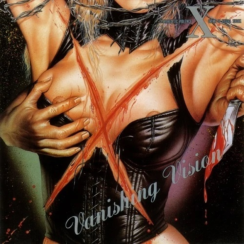

## 个人听感

每个被认为“向市场投降”的乐队都有一张“初心专辑”（悲），对于 X 而言就是这张『Vanishing Vision』。

『Vanishing Vision』中既有 VANISHING LOVE、I'LL KILL YOU 这种在地下时期常玩的速度金属，也有 ALIVE 这种与后来的 ART OF LIFE 等一脉相承的 YOSHIKI 味抒情作品。

虽然 TOSHI 胡乱发音的英语非常出戏，ALIVE 这首歌我还是非常喜欢的。在前奏中运用了贝多芬著名的 Quasi una fantasia, Op. 27, No. 2 月光奏鸣曲里的旋律，这可能是 X 第一次在作品中加入钢琴。很遗憾，副歌部分的高音对于 TOSHI 来说也显得太变态，所以这首都没几个现场。

KURENAI、UN-FINISHED... 这两首与『BLUE BLOOD』里收录的相比就是半成品，建议去听『BLUE BLOOD』的版本。SADISTIC DESIRE 倒是更喜欢这张专辑里的版本。

这张专辑也展现乐队除了 YOSHIKI 之外，TAIJI 和 HIDE 的创作能力。尤其是 HIDE 的 SADISTIC DESIRE，超级合我的胃口。X 在中后期逐渐向 YOSHIKI 一手包办的方向发展，TAIJI 在『Jealousy』后的离队使得乐队风格更加单一。至于新世纪重组之后，其实没有什么令我印象深刻的作品。

在 HIDE 和 TAIJI 都先后因意外离我们而去，YOSHIKI 和 TOSHI 的关系已来到冰点的今天，恐怕对 X 而言，不会再有『Vanishing Vision』这样的专辑了。

## 歌曲

**最推荐的几首：VANISHING LOVE、SADISTIC DESIRE、ALIVE**

### DEAR LOSER

<audio controls preload="none" style="width: 100%;">
    <source src="mp3/[1] DEAR LOSER.mp3" type="audio/mp3" />
</audio>

    作曲：TAIJI

### VANISHING LOVE

<audio controls preload="none" style="width: 100%;">
    <source src="mp3/[2] VANISHING LOVE.mp3" type="audio/mp3" />
</audio>

    作词：YOSHIKI
    作曲：YOSHIKI

### PHANTOM OF GUILT

<audio controls preload="none" style="width: 100%;">
    <source src="mp3/[3] PHANTOM OF GUILT.mp3" type="audio/mp3" />
</audio>

    作词：TOSHI
    作曲：TAIJI
    
### SADISTIC DESIRE

<audio controls preload="none" style="width: 100%;">
    <source src="mp3/[4] SADISTIC DESIRE.mp3" type="audio/mp3" />
</audio>

    作词：YOSHIKI
    作曲：HIDE

### GIVE ME THE PLEASURE

<audio controls preload="none" style="width: 100%;">
    <source src="mp3/[5] GIVE ME THE PLEASURE.mp3" type="audio/mp3" />
</audio>

    作词：YOSHIKI
    作曲：TAIJI & HIDE
    
### I'LL KILL YOU

<audio controls preload="none" style="width: 100%;">
    <source src="mp3/[6] I'LL KILL YOU.mp3" type="audio/mp3" />
</audio>

    作词：YOSHIKI
    作曲：YOSHIKI
    
### ALIVE

<audio controls preload="none" style="width: 100%;">
    <source src="mp3/[7] ALIVE.mp3" type="audio/mp3" />
</audio>

    作词：YOSHIKI
    作曲：YOSHIKI
    
### KURENAI

<audio controls preload="none" style="width: 100%;">
    <source src="mp3/[8] KURENAI.mp3" type="audio/mp3" />
</audio>

    作词：YOSHIKI
    作曲：YOSHIKI
    
### UN-FINISHED...

<audio controls preload="none" style="width: 100%;">
    <source src="mp3/[9] UN-FINISHED....mp3" type="audio/mp3" />
</audio>

    作词：YOSHIKI
    作曲：YOSHIKI