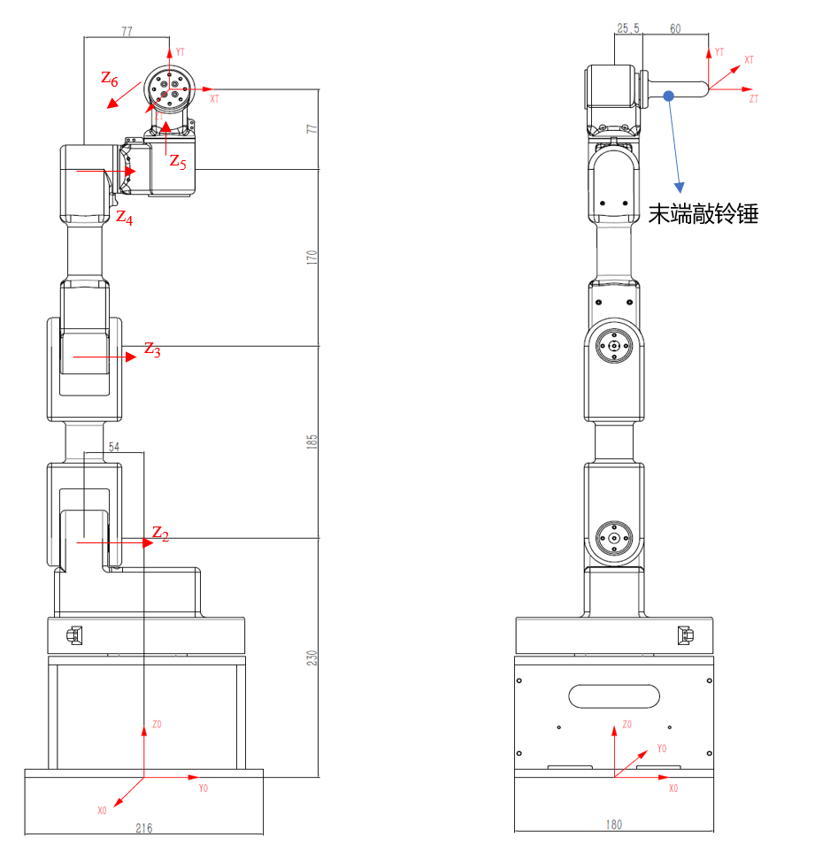

## 机械臂说明与 D-H 参数

ZJU-I 型桌面机械臂为典型的六自由度机械臂。一个机械臂运行的视频：

<video controls muted preload="none" style="width: 100%;">
    <source src="1.mp4" type="video/mp4">
</video>



关节角限制为：

| | 关节一 | 关节二 | 关节三 | 关节四 | 关节五 | 关节六 |
| ---- | ----- | ----- | ----- | ----- | ----- | ----- |
| 最小关节值（度） | -150 | -90 | -120 | -150 | -150 | -180 |
| 最大关节值（度） | 150 | 90 | 120 | 150 | 150 | 180 |

坐标系有多种选取方式。机械臂的 D-H 参数的一种表示为：

| α    | a     | d      | θ                  |
| ---- | ----- | ------ | ------------------ |
| 0    | 0     | 0.23   | θ<sub>1</sub>      |
| -π/2 | 0     | -0.054 | -π/2+θ<sub>2</sub> |
| 0    | 0.185 | 0      | θ<sub>3</sub>      |
| 0    | 0.17  | 0.077  | π/2+θ<sub>4</sub>  |
| π/2  | 0     | 0.077  | π/2+θ<sub>5</sub>  |
| π/2  | 0     | 0.0855 | θ<sub>6</sub>      |

## 求解变换矩阵

显然，手算求解机械臂的变换矩阵非常困难。

我们利用 Mathematica 强大的符号计算功能帮助我们运算，代码为：

```mathematica
ConvertDh[dh_] :=
    (
        len = Length[dh];
        h = Table[0, {i, len}];
        For[i = 1, i <= len, i++,
            h[[i]] = ({{Cos[dh[[i, 4]]], -Sin[dh[[i, 4]]], 0, dh[[i, 
                2]]}, {Sin[dh[[i, 4]]] * Cos[dh[[i, 1]]], Cos[dh[[i, 4]]] * Cos[dh[[i,
                 1]]], -Sin[dh[[i, 1]]], -Sin[dh[[i, 1]]] * dh[[i, 3]]}, {Sin[dh[[i, 
                4]]] * Sin[dh[[i, 1]]], Cos[dh[[i, 4]]] * Sin[dh[[i, 1]]], Cos[dh[[i,
                 1]]], Cos[dh[[i, 1]]] * dh[[i, 3]]}, {0, 0, 0, 1}})
        ];
        T = h[[1]];
        For[i = 2, i <= len, i++,
            T = T . h[[i]]
        ];
        FullSimplify[T]
    );
```

求出变换矩阵为：

$$
\left[\begin{array}{cccc}
-c_6\left(c_5 s_1+c_1 c_{234} s_5\right)+c_1 s_{234} s_6 & c_5 s_1 s_6+c_1\left(c_6 s_{234}+c_{234} s_5 s_6\right) & c_1 c_{234} c_5-s_1 s_5 & c_1\left(0.0855 c_{234} c_5+0.185 s_2+0.17 s_{23}+0.077 s_{234}\right)+s_1\left(-0.023-0.0855 s_5\right) \\\
c_1 c_5 c_6+s_1\left(-c_{234} c_6 s_5+s_{234} s_6\right) & c_6 s_1 s_{234}+\left(-c_1 c_5+c_{234} s_1 s_5\right) s_6 & c_{234} c_5 s_1+c_1 s_5 & s_1\left(0.0855 c_{234} c_5+0.185 s_2+0.17 s_{23}+0.077 s_{234}\right)+c_1\left(0.023+0.0855 s_5\right) \\\
c_6 s_{234} s_5+c_{234} s_6 & c_{234} c_6-s_{234} s_5 s_6 & -c_5 s_{234} & 0.23+0.185 c_2+0.17 c_{23}+0.077 c_{234}-0.0855 c_5 s_{234} \\\
0 & 0 & 0 & 1
\end{array}\right]
$$

写得方便看一点：

$$
\begin{aligned}
t_{11} &= -c_{6}\left(c_{5} s_{1}+c_{1} c_{234} s_{5}\right)+c_{1} s_{234} s_{6} \\\
t_{12} &= c_{5} s_{1} s_{6}+c_{1}\left(c_{6} s_{234}+c_{234} s_{5} s_{6}\right) \\\
t_{13} &= c_{1} c_{234} c_{5}-s_{1} s_{5} \\\
t_{14} &= c_{1}\left(0.0855 c_{234} c_{5}+0.185 s_{2}+0.17 s_{23}+0.077 s_{234}\right)+s_{1}\left(-0.023-0.0855 s_{5}\right) \\\
t_{21} &= c_{1} c_{5} c_{6}+s_{1}\left(-c_{234} c_{6} s_{5}+s_{234} s_{6}\right) \\\
t_{22} &= c_{6} s_{1} s_{234}+\left(-c_{1} c_{5}+c_{234} s_{1} s_{5}\right) s_{6} \\\
t_{23} &= c_{234} c_{5} s_{1}+c_{1} s_{5} \\\
t_{24} &= s_{1}\left(0.0855 c_{234} c_{5}+0.185 s_{2}+0.17 s_{23}+0.077 s_{234}\right)+c_{1}\left(0.023+0.0855 s_{5}\right) \\\
t_{31} &= c_{6} s_{234} s_{5}+c_{234} s_{6} \\\
t_{32} &= c_{234} c_{6}-s_{234} s_{5} s_{6} \\\
t_{33} &= -c_{5} s_{234} \\\
t_{34} &= 0.23+0.185 c_{2}+0.17 c_{23}+0.077 c_{234}-0.0855 c_{5} s_{234} \\\
t_{41} &= 0 \\\
t_{42} &= 0 \\\
t_{43} &= 0 \\\
t_{44} &= 1
\end{aligned}
$$

## 正运动学

我们完成了 ForwardKinematicsZJU 函数，输入关节角，得到末端空间位置和 XYZ 欧拉角。由于代码太长，这里不做展示，可在文末链接查看。

例如：

```mathematica {linenos=false}
In[=] := Import[FileNameJoin[{NotebookDirectory[], "zjui.wl"}]](*导入 zjui.wl*)

In[=] := ForwardKinematicsZJU[{Pi/6, 0, Pi/6, 0, Pi/3, 0}]
In[=] := {0.0904941, 0.164305, 0.607533, -1.82391, -0.0580453, -2.69295}
```

## 逆运动学

我们完成了 BackwardKinematicsZJU 函数，输入末端空间位置和 XYZ 欧拉角，得到 6 个关节角。（可能输出多组解，已考虑关节角限制）

例如：

```mathematica {linenos=false}
In[=] := Import[FileNameJoin[{NotebookDirectory[], "zjui.wl"}]](*导入 zjui.wl*)

In[=] := BackwardKinematicsZJU[{0.117, 0.334, 0.499, -2.019, -0.058, -2.190}]
In[=] := {{1.04692, 0.543234, 0.531454, -0.551512, 0.523909, 0.698541}, {1.04692, 1.05169, -0.531454, 0.00294118, 0.523909, 0.698541}}
```

## 开源链接

Github 开源仓库：[ZJUI-Arm-Kinematics](https://github.com/Mythologyli/ZJUI-Arm-Kinematics)

## 参考资料

[六轴UR机械臂标准DH正逆运动学公式推导+代码验证C++
](https://blog.csdn.net/sinat_32804425/article/details/122125911) 作者：[FuYongqing0412](https://blog.csdn.net/sinat_32804425?type=blog)

如果不知道如何安装 Mathmetica，可以参考：[Mathematica 激活指南
](https://tiebamma.github.io/InstallTutorial/)

## 致谢

感谢 [DX3906G](https://github.com/DX3906G) 同学提供的逆运动学运算步骤。