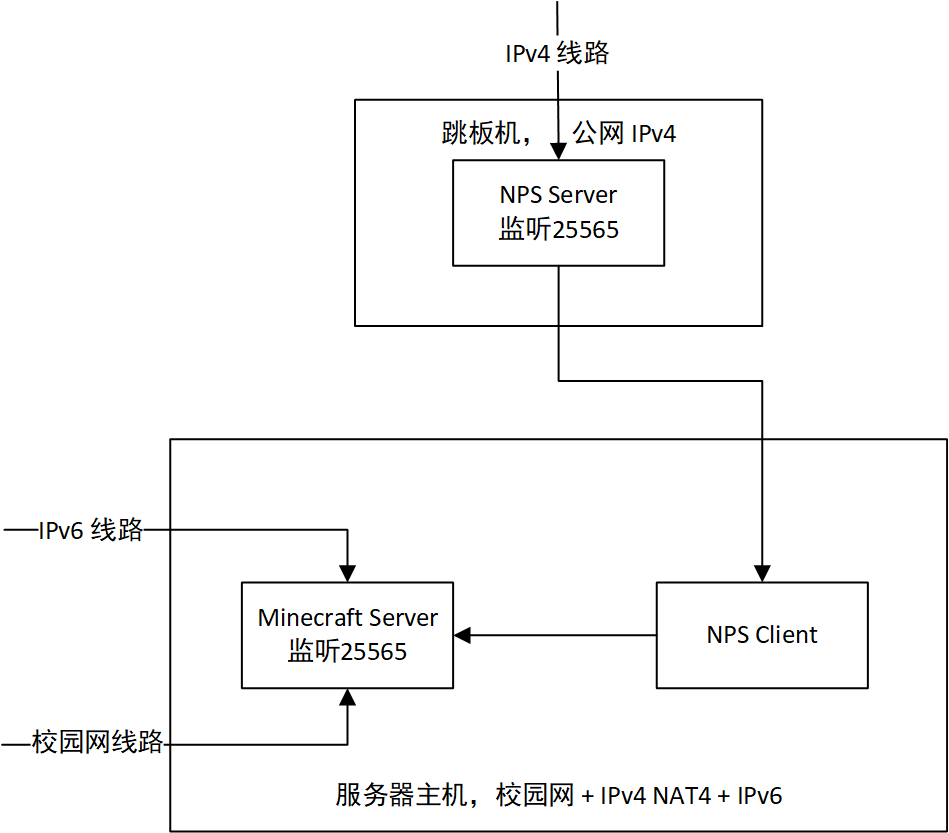
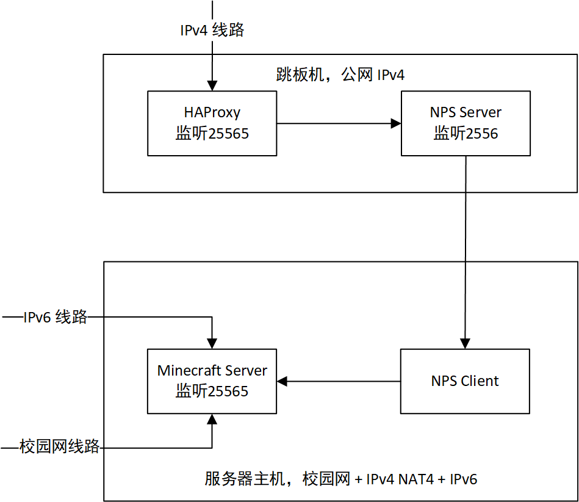

对于笔者这样没有公网 IP 的服主而言，如何让玩家在仅有 IPv4 的情况下访问服务器是一个大问题。

在家宽环境下，NAT 类型往往比较理想，可以利用类似 [qBittorrent TCP 打洞](https://myth.cx/p/qbittorrent-nat-tcp-hole-punching)的方法，为玩家提供公网 IPv4 线路。但在校园网环境下，往往没有 Full Cone NAT 条件，无法进行 TCP 打洞。此时就只能采用内网穿透的办法，通过一台具有公网 IPv4 地址的服务器做跳板，实现访问。

一直以来，笔者的服务器 [Akashic MC](https://mc.akashic.cc) 的游戏线路如下：

<div style="text-align:center"></div>

其中，IPv6 线路和校园网线路都是直接连接到服务端的。而 IPv4 线路是通过 NPS 内网穿透连接的。对于 IPv6 和校园网玩家而言，他们的 IP 都可以正常被服务端获取。而 IPv4 玩家的 IP 均为 127.0.0.1，这是因为对于 Minecraft 服务端而言，TCP 传入连接的源地址始终是 NPS Client 的 127.0.0.1。真正的源地址只有 NPS Server 知道，但这一信息无法传达给 Minecraft 服务端。

玩家 IP 错误会造成种种问题。典型的例子是无法使用 `/banip` 命令，这会将所有使用 IPv4 线路的玩家封禁。

## HTTP 为什么可以？

众所周知，Web 的世界里存在着大量的反向代理。例如在 Nginx 上配置反代，转发给后端服务。这种情况下，TCP 连接的源地址同样只有 Nginx 知道，可是为什么后端服务能正确获取客户端 IP 呢？

这是因为 HTTP 协议中有一个 `X-Forwarded-For` 头，用于记录客户端的 IP 地址。以 Nginx 为例，可以通过配置 `proxy_set_header X-Forwarded-For $remote_addr;` 来将客户端 IP 传递给后端服务。

由此我们可知，尽管 Nginx 发送到后端服务的 TCP 包中的源 IP 已经不是客户端 IP 了，但由于包裹在 TCP 中的 HTTP 协议本身记录了源 IP，故即使进过多层转发，后端服务也可以正确获取 IP。

## BungeeCord?

HTTP 协议对我们的启示是：我们需要在协议中记录源 IP，并让 Minecraft 服务端正确读取。而原版的服务端和协议显然不支持这一点。为了解决这一问题，笔者首先想到了 BungeeCord。

在使用 BungeeCord 时，如果在 Spigot 服务端和 BungeeCord 端同时打开 ip_forward 相关功能，Spigot 服务端可以正确获取玩家 IP。与 HTTP 的情况类似，BungeeCord 会在转发数据包时，将玩家 IP 附加在数据包中。Spigot 支持 BungeeCord 的相关协议，可以正确解析玩家 IP。

但对于笔者的用例，BungeeCord 不太适合：

1. BungeeCord 需要 Java 运行时，而笔者的跳板机只有可怜的 256M 内存，BungeeCord 对于它来说太吃力。

2. 如果 Spigot 端开启了 BungeeCord 支持，便无法直接连接到服务端，而必须通过 BungeeCord 连接。但笔者还要支持 IPv6 和校园网玩家，故还需要在服务器主机再部署一个 BungeeCord，整个架构变得十分复杂。

## HAProxy

放弃了 BungeeCord，笔者开始寻找其他解决方案。在搜索相关信息时，笔者发现了 HAProxy：

> HAProxy is a free, very fast and reliable reverse-proxy offering high availability, load balancing, and proxying for TCP and HTTP-based applications. It is particularly suited for very high traffic web sites and powers a significant portion of the world's most visited ones. Over the years it has become the de-facto standard opensource load balancer, is now shipped with most mainstream Linux distributions, and is often deployed by default in cloud platforms. Since it does not advertise itself, we only know it's used when the admins report it

可以看到，HAProxy 是一个具有良好负载均衡功能的代理，这本与本文的主题不太相关。不过笔者发现，HAProxy 支持一个叫做 [Proxy Protocol](https://www.haproxy.com/blog/use-the-proxy-protocol-to-preserve-a-clients-ip-address) 的协议：

> What is the Proxy Protocol? It is a network protocol for preserving a client’s IP address when the client’s TCP connection passes through a proxy. Without such a mechanism, proxies lose this information because they act as a surrogate for the client, relaying messages to the server but replacing the client’s IP address with their own. This distorts the logs of upstream servers because the logs incorrectly indicate that all traffic originated at the proxy.

这不正是我们想要的吗！现在剩下的问题就是：Spigot 能否支持 Proxy Protocol？开启 Proxy Protocol 支持时是否还能直接连接？

在 GitHub 一搜，居然找到一个完美符合笔者要求的项目：[HAProxyDetector](https://github.com/andylizi/haproxy-detector)

> This BungeeCord (and now Spigot and Velocity) plugin enables proxied and direct connections both at the same time.

现在解决问题所需的一切条件都凑齐了。

## 解决方案

<div style="text-align:center"></div>

我们在跳板机上部署 HAProxy 并监听 25565，修改 NPS 中对应转发的端口为 2556。在 HAProxy 配置中添加如下内容：

```
listen minecraft
        bind *:25565
        mode tcp
        balance leastconn
        option tcp-check
        server minecraft1 127.0.0.1:2556 send-proxy
```

此时 HAProxy 将收到的 TCP 包处理后，通过 NPS 发送到服务端。服务端通过 [HAProxyDetector](https://github.com/andylizi/haproxy-detector) 插件，从 TCP 包中读取源 IP，即可正确获取玩家 IP。同时，通过 HAProxyDetector 的检测功能，IPv6 和校园网玩家也可以正常连接。