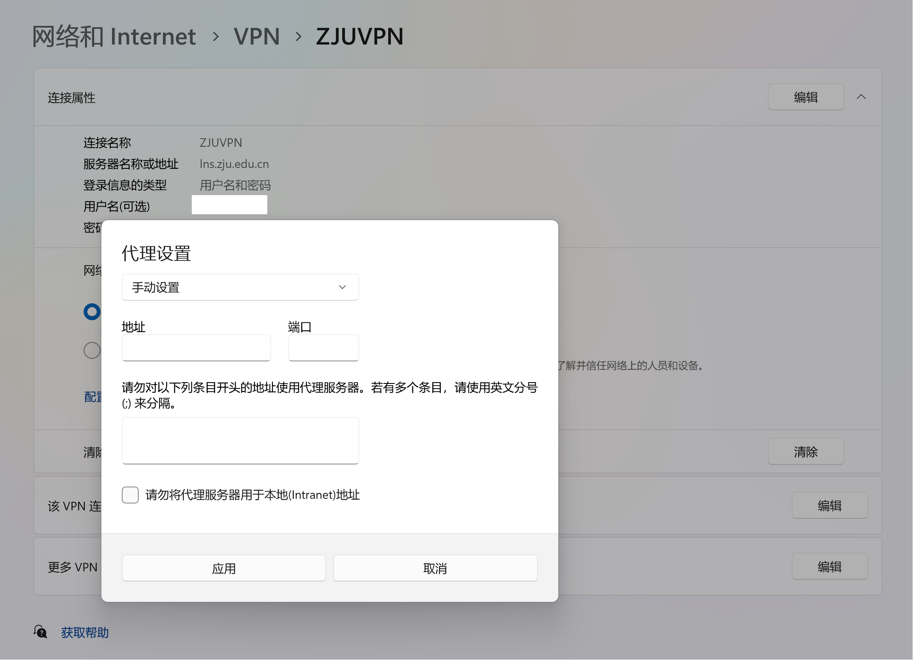
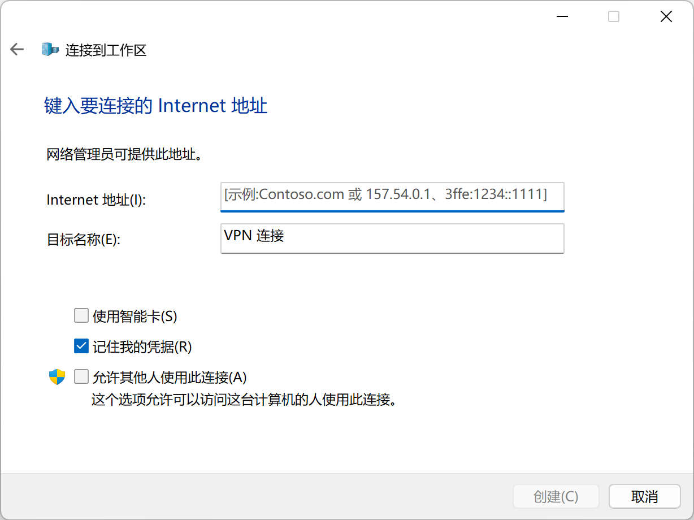

想必大家都经常用到 Windows 系统代理设置——即使没有亲自修改，多半也由软件代劳了。毕竟科学上网客户端干的事情通常都是：开启一个 HTTP 代理服务端，然后配置系统代理去设置去使用它。

但是，某些情况下，Windows 系统代理却会出现一些玄学问题。比如，使用 ZJU 官方的有线校网客户端，或是自己创建名称带有中文的 L2TP VPN 时，系统代理设置好像无效了——浏览器说什么也不肯通过代理访问互联网。只好借助 SwitchyOmega 这样的插件，但总觉得不爽。又或者，在使用 L2TP VPN 环境下使用 Clash Verge，也会出现系统代理无效的问题。

这篇文章通过试验，探究了 Windows 系统代理的一些细节，试图为以上问题找到答案。

## 最基本的情况——无拨号连接

首先，我们来看看最基本的情况：没有任何拨号连接，即通过路由器直接上网。

我们使用 Clash for Windows，在 7890 端口上开启 HTTP 代理服务器。之后，不用 Clash for Windows 内置的功能，而是在设置 - 网络和 Internet - 代理中进行手动配置。

<div style="text-align:center"></div>

开启“使用代理服务器”后，我们可以发现 Clash log 中已经有浏览器的流量，这说明浏览器正在使用代理上网。

为了知其所以然，让我们看看此时在注册表里发生了什么：


可以发现，`HKEY_CURRENT_USER\Software\Microsoft\Windows\CurrentVersion\Internet Settings` 中的 `ProxyEnable` 被设置为 `1`，`ProxyServer` 被设置为 `127.0.0.1:7890`，`ProxyOverride` 被设置为 `localhost; <local>`。这三个值分别对应“使用代理服务器”、“代理 IP 地址 + 端口”、“不使用代理服务器的地址”这三个选项。

## 就这么简单吗？——还有设置！

要是就这么简单就好了。实际上，仔细观察注册表，就会发现还有设置！

进入 `HKEY_CURRENT_USER\Software\Microsoft\Windows\CurrentVersion\Internet Settings\Connections`，查看 `DefaultConnectionSettings` 键的值，这是一个二进制：

<div style="text-align:center"></div>

诶！怎么又来一份代理设置！而且是一模一样的！

我们回到设置 - 网络和 Internet - 代理中，将端口从 7890 改成 7891，然后再看看注册表：`ProxyServer` 变了，`DefaultConnectionSettings` 也变了。此时浏览器也无法正常上网。看来在设置中的修改会同时影响这两个。

那么，浏览器上网的代理到底由哪个决定呢？我们直接在注册表修改 `DefaultConnectionSettings`，将端口改回 7890，此时浏览器又可以正常上网了。看来 `DefaultConnectionSettings` 决定浏览器上网的代理。

实际上，`DefaultConnectionSettings` 对应着 Internet 属性 - 连接 - 局域网设置，这是从古老的 IE 那里流传下来的设置界面——即使现在 IE 已经没了但这个界面还在控制面板里。


另外，还有一个有趣的现象——这两个键会互相影响。例如，初始情况下 `ProxyServer` 和 `DefaultConnectionSettings` 中的端口均为 7890，此时可以正常上网。此时修改 `ProxyServer` 中的端口为 7899，就会发现不能上网了——奇怪，不是应该由 `DefaultConnectionSettings` 决定吗？但此时再去检查 `DefaultConnectionSettings`，发现也跟着变了。再把 `DefaultConnectionSettings` 改回 7890，立马又可以上网了，不过 `ProxyServer` 没有变回 7890。但打开设置后，`ProxyServer` 也变回 7890 了。

## 拨号连接——又来一份设置！

进过一番讨论，无拨号的情况研究的差不多了——别急，还有拨号连接呢！

我们先复原所有代理设置，创建一个名为 ZJUVPN 的 L2TP VPN 并连接，然后重复一开始的过程：在设置 - 网络和 Internet - 代理中进行手动配置。此时的结果就和我们预想的大不相同了：没有用！还是在直连。查看注册表，更觉得古怪：


首先，`ProxyServer` 和 `ProxyOverride` 消失了，只有 `ProxyEnable` 还在，但是值是 0——这和说好的不一样啊，设置里代理不是启用状态吗？再看 `DefaultConnectionSettings`，这个好像比较正常（此时在设置里更改还是可以改变 DefaultConnectionSettings 的值），但是不生效。不过，仔细看看 `HKEY_CURRENT_USER\Software\Microsoft\Windows\CurrentVersion\Internet Settings\Connections`，原因显而易见了：


Connections 中多出了一个名为 `ZJUVPN` 的键，并且看起来是没有设置的。打开 Internet 属性 - 连接，也可以看到多了一个 ZJUVPN 配置项。


看来，Windows 的 VPN 拨号连接的设置是独立的，而设置 - 网络和 Internet - 代理中的设置只对无拨号连接生效。要更改 VPN 拨号连接的代理设置，需要在 Internet 属性 - 连接中进行更改。当然，Windows 也做了相应的现代界面（经典的设置+控制面板）：



单独修改代理设置后，浏览器可以正常使用代理。可以看到，这一设置较为隐蔽。一些科学上网客户端也忽略了这一点，导致无法在使用 VPN 时正确设置系统代理。详见[此链接](https://github.com/zzzgydi/clash-verge/issues/833)。

## 中文名称——锟斤拷的噩梦

众所周知，使用 ZJU 有线校网客户端会导致梯子无法正常工作。我们来看看这究竟是为什么。（友情提示：有线校网客户端容易炸注册表，强烈建议在虚拟机内试验）

成功连接客户端后，在终端输入 `ipconfig` 命令：

```
C:\Users\Myth>ipconfig

Windows IP 配置


以太网适配器 Ethernet0:

   连接特定的 DNS 后缀 . . . . . . . : localdomain
   本地链接 IPv6 地址. . . . . . . . : fe80::8f6a:5577:f304:1fea%6
   IPv4 地址 . . . . . . . . . . . . : 192.168.163.132
   子网掩码  . . . . . . . . . . . . : 255.255.255.0
   默认网关. . . . . . . . . . . . . : 192.168.163.2

PPP 适配器 SRun3K专用宽带拨号连接:

   连接特定的 DNS 后缀 . . . . . . . :
   IPv4 地址 . . . . . . . . . . . . : 222.205.2.241
   子网掩码  . . . . . . . . . . . . : 255.255.255.255
   默认网关. . . . . . . . . . . . . : 0.0.0.0

以太网适配器 蓝牙网络连接:

   媒体状态  . . . . . . . . . . . . : 媒体已断开连接
   连接特定的 DNS 后缀 . . . . . . . :
```

有线客户端创建了一个名为“SRun3K专用宽带拨号连接”的 PPP 适配器，通过这个适配器访问互联网。此时手动配置设置 - 网络和 Internet - 代理。根据上一节的经验，我们知道 Internet 属性 - 连接中会出现一个新的配置...嗯？

<div style="text-align:center"></div>

怎么空空如也？赶快看看注册表：


好家伙，乱码了！看来又是 GBK 和 Unicode 混用搞得鬼！有没有可能手动修改这个乱码键的值来设置代理呢？试了试发现不行。不过，手动新建一个名为“SRun3K专用宽带拨号连接”的键，然后把 `DefaultConnectionSettings` 的值偷过来，发现可以正常使用代理了。


自建中文名称的 L2TP VPN 也同理，同样会因为中文乱码造成无法设置系统代理的问题。

## 默认 VPN 名称含中文——巨硬的坑人大法

写到这里有读者可能会好奇——为什么那么多人创建名称含中文的 L2TP VPN 呢？呵呵，这就要问问微软了。



默认名称？？！！

## 总结——复杂而混乱的代理设置体系

Windows 复杂而混乱的代理设置体系给我们带来了许多困难。用户和开发者很容易忽视拨号连接代理设置的独立性，造成种种问题，更何况还有中文乱码这个大坑。

在这方面的使用、开发中，必须要注意：

+ 程序在设置系统代理时，不可遗漏 `HKEY_CURRENT_USER\Software\Microsoft\Windows\CurrentVersion\Internet Settings\Connections` 中的键值。当然二进制的形式给开发者带来了更多困难。

+ 使用 VPN 时，要注意不能创建名称含有中文的网络适配器。