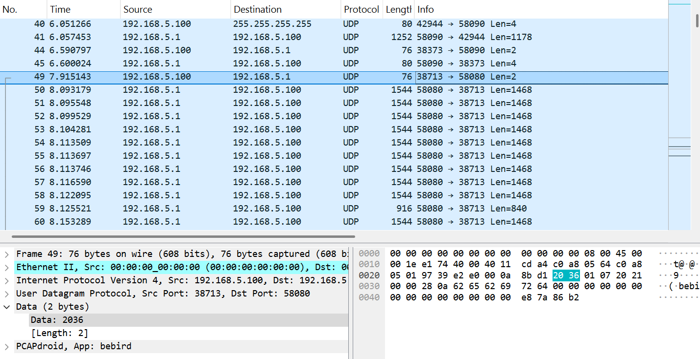

笔者最近在 B 站看到很多可视洁耳仪的推荐，于是入手了一款 [bebird Note 5 可视洁耳仪](https://www.bebirdintl.com/products/family/bebird-note5ji-xie-bi-ke-shi-er-shao.html)。使用体验还不错，但 bebird 没有提供 PC 客户端，导致必须要配合手机才能显示摄像头画面，低头盯着手机的小屏幕操作太难受了。这怎么行呢？这就开始逆向分析+手搓客户端！

本文所述的内容仅适用于 bebird Note 5，不过同一个公司的产品大概也大同小异。

## 抓包分析

bebird Note 5 的使用方法为：首先拔出保护罩，洁耳仪自动开机；之后用手机连接 SSID 为 `bebird-Note5-xxxx` 的 Wi-Fi，打开 APP，点击开始即可查看洁耳仪摄像头画面。

笔者使用 [PCAPdroid](https://github.com/emanuele-f/PCAPdroid) 对 bebird APP 的流量进行抓包。结果如下：



可以发现，APP 与洁耳仪之间的通信是通过 UDP 进行的：

1. APP 发送 UDP 广播包 `66390101`
2. 洁耳仪 `192.168.5.1:58080` 返回文本

    ```json
    {
        {
            "uuid": "13EE6135082E4E56880AA2831DD53D46",
            "sn": "v9onosWEusKZCoIM12InCJLxzXgx7ucM",
            "factory": false,
            "show_fname": true,
            "nickname": "",
            "parent": "HC",
            "model": "Note5",
            "brand": "bebird",
            "ssid_prefix": "bebird",
            "random_num": 838130,
            "soc": "BEBIRD",
            "hardware": "1.0.10",
            "firmware": "2.1.30",
            "fw_date": "Aug  2 2023 17:20:21",
            "bat_capacity": "130mAh",
            "bat_life": [
                3047,
                4100,
                40
            ],
            "bat_charge": false,
            "web_home_size": 32637,
            "macid": "FC584ACA9CC5",
            "macrd": "A89CEDB40636",
            "imu_axis": 3,
            "imu_devid": 39,
            "calibrated": [
                0,
                0,
                0,
                0,
                0,
                0
            ],
            "cam_brightness": 70,
            "cam_devid": 51,
            "cam_chipid": 56853,
            "cam_initex": [],
            "jpeg_rate_ctrl": [
                0,
                20,
                30,
                1
            ],
            "wifi_direct": false,
            "wifi_mode": 0,
            "has_ble": false,
            "has_http": true,
            "tssi_gb": 27005,
            "videotime": 2499,
            "video_hdq": false,
            "rlb_time": 3600,
            "powerup_cnt": 53,
            "stream_type": "mjpeg",
            "country": [
                "CN"
            ],
            "wifi_encrypt": false,
            "wifi_channel": 11,
            "reliability": false,
            "save_ap": false,
            "rotate_angle": -90,
            "ota_url": "http://192.168.5.88:8080/ota",
            "batch_no": [
                "888888888888888",
                "666666666666"
            ],
            "designed_by": "Heifeng Zhizao Technology Co., Ltd",
            "manufacturer": "Lingmou Zhizao Technology Co., Ltd",
            "production_date": "2020-08-18 17:56:18",
            "activation_date": "2024-01-01 21:46:29",
            "last_conn_date": "never"
        }
    }
    ```
3. APP 向洁耳仪 `192.168.5.1:58080` 发送 `663A`
4. 洁耳仪 `192.168.5.1:58080` 返回 `00010041`
5. APP 向洁耳仪 `192.168.5.1:58080` 发送 `2036`
6. 洁耳仪开始视频传输

从第 2 步返回的 JSON 中可以发现 `"stream_type": "mjpeg"`，故视频应该是以 JPEG 帧的格式传输的。

观察传输视频的包，可以发现：

1. N 个包为一组，前 N-1 个包大小为 1468，最后一个包较小，大小不确定
2. 第 1 组 (N=10) 包中的第 1 个包开头为 `01000108FFD8FFE0....`，其中 `FFD8` 为 JPEG 的开始标志
3. 第 1 组包中的第 2 到第 9 个包开头为 `01000208....` 到 `01000908....`
4. 第 1 组包中的第 10 个包开头为 `01020A3C....`，结尾为 `....FFD900B7360000`，其中 `FFD9` 为 JPEG 的结束标志

由此可知，若干个包为一组，传输一帧 JEPG 图像，每个包都有编号保证顺序。

## APK 分析

由上面得到的内容已经可以尝试编写客户端，不过我们先分析一下 bebird 的 APK 文件。

新版本经过了混淆不好分析，使用旧版本 [v6.1.01](https://www.wandoujia.com/apps/7918983/history_v60101)，通过 [jadx-gui](https://github.com/skylot/jadx) 反编译。

`com.blackbee.libbb` 中有如下内容：

```java
private static final byte[] SOI_MARKER = {-1, -40};
private static final byte[] EOF_MARKER = {-1, -39};
private static final byte[] BK_START_VIDEO = {32, 54};
private static final byte[] BK_STOP_VIDEO = {32, 55};
private static final byte[] BK_START_OTA = {102, 56};
private static final byte[] BK_START_CONF = {102, 57, 1, 1};
private static final byte[] BK_GET_APLIST = {102, 57, 2};
private static final byte[] BK_CONNECT_AP = {102, 57, 3, 1};
private static final byte[] BK_FORGET_AP = {102, 57, 4};
private static final byte[] BK_GET_CONNECTED_AP = {102, 57, 5};
private static final byte[] BK_GET_SELF_AP = {102, 57, 6};
private static final byte[] BK_GET_BAT_VOLTAGE = {102, 58};
private static final byte[] BK_SET_CAM_EFFECT = {102, 59, 0};
private static final byte[] BK_SET_CAM_BRIGHTNESS = {102, 60, 0};
private static final byte[] BK_START_AP = {102, 61};
private static final byte[] BK_REBOOT = {102, 62};
private static final byte[] BK_TRIGGER_LED = {102, Utf8.REPLACEMENT_BYTE, 0, 0};
private static final byte[] BK_TRIGGER_TWEEZERS = {102, 64, 0};
private static final byte[] BK_TRIGGER_RELIABILITY = {102, 65, 0};
private static final byte[] BK_TOGGLE_ANGLE = {-122, 6, 0};
```

注意到，第一步中出现的 `66390101` 在十进制下为 `{102, 57, 1, 1} (BK_START_CONF)`，`663A` 在十进制下为 `{102, 58} (BK_GET_BAT_VOLTAGE)`，`2036` 在十进制下为 `{32, 54} (BK_START_VIDEO)`。由此我们可以弄明白这些控制字节的含义。

## Python 客户端 Demo

通过以上分析，我们可以实现一个简单的客户端：

```python
import socket
from io import BytesIO

import cv2
import numpy as np
from PIL import Image, ImageFile

ImageFile.LOAD_TRUNCATED_IMAGES = True


def main():
    client_socket = socket.socket(socket.AF_INET, socket.SOCK_DGRAM)
    client_socket.settimeout(1)
    client_socket.sendto(b'\x20\x37', ("192.168.5.1", 58080))
    client_socket.sendto(b'\x20\x36', ("192.168.5.1", 58080))

    full_data = b''

    cv2.namedWindow("bebird", cv2.WINDOW_AUTOSIZE)
    while True:
        try:
            data, server = client_socket.recvfrom(1500)
            if data[4:6] == b'\xff\xd8':
                full_data = data[4:]
            elif data[-7:-5] == b'\xff\xd9':
                full_data += data[4:-5]
                try:
                    img = np.array(Image.open(BytesIO(full_data)))
                    img = cv2.cvtColor(img, cv2.COLOR_RGB2BGR)
                    cv2.imshow("bebird", img)
                    cv2.waitKey(1)
                except Exception as e:
                    print(e)
            else:
                full_data += data[4:]
        except socket.timeout:
            print('Socket timeout')


if __name__ == "__main__":
    main()
```


上述代码没有考虑 UDP 非顺序到达的情况，有待进一步完善。

## Github Repo

[Mythologyli/py-bebird-viewer](https://github.com/Mythologyli/py-bebird-viewer)