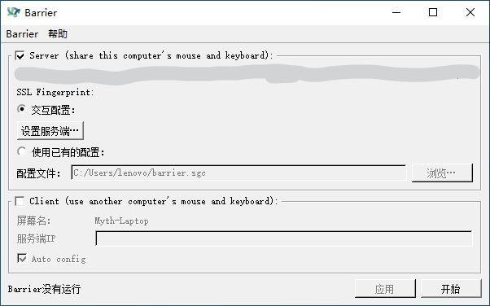
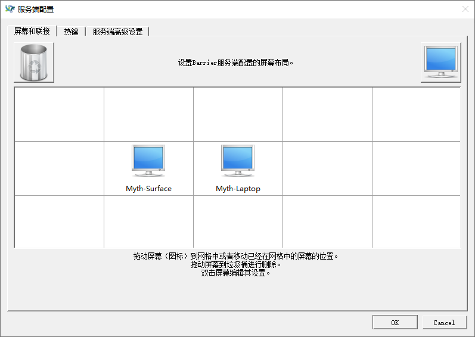

## 前言

笔者有一台拯救者和一台 Surface。平时在宿舍时，当然更喜欢用游戏本的键鼠操作。不过若要使用两台电脑，就得不断移动手去分别操作两台电脑的键鼠，非常麻烦。

用过双屏的同学们一定知道，只要将光标移动出屏幕边缘就可以让光标移动到另一个屏幕上去。但现在的情景是两台电脑，而非一台电脑两个显示器。Windows 的原生功能显然无法解决这个问题。下面有请 Barrier 登场。

## What is Barrier?

[项目地址](https://github.com/debauchee/barrier)

Barrier 是一个开源软件，是 symless 公司开源项目 
synergy-core 的一个分支。使用 Barrier，你可以通过移动光标的方式，用一台电脑（server）的键鼠操作同一局域网下的多台电脑（client），甚至可以共享这些电脑的剪贴板。原先的软件 Synergy 可以做一样的事，但 symless 将这套系统商业化了，只开源了核心 synergy-core。Barrier 可以理解为基于 synergy-core 的开源软件，好处是免费，不过少了一些不那么重要的功能（如跨电脑复制文件）。

## Usage

接下了介绍如何在浙江大学校园网络环境下在两台电脑上配置 Barrier，实现键鼠的共享。

+ 首先[下载 Barrier](https://github.com/debauchee/barrier/releases)。请分别为 Server（你要使用的键鼠所在的电脑）和 client（被控电脑）下载合适版本的软件。Windows: .exe | Mac: .dmg

+ 分别在 server 机和 client 机上安装软件。

+ 首先配置 server 一侧。打开 barrier，会出现这样一个界面：

  

  我们勾选 server，来将程序配置为 server 模式。注意到上面打码的地方有一排 IP 地址，找到 10 开头的那个，那是你在校园局域网下的 IP。（用路由器的同学可以用路由器分配的 IP）

  点击应用 - 开始，使程序运行，等待连接。

+ 再配置 client 一侧。打开 barrier，这次我们勾选 client，同时，在服务端 IP 处填写刚刚记录的 10 开头的 IP。点击应用 - 开始。

+ 我们回到 server 一侧。点击设置服务端，可以看到这样的界面：

  

  你可能只能看到一个屏幕。从右上角拖一个电脑到网格中，双击配置屏幕名为 client 机的屏幕名（client 端有显示）。如果不小心弄多了，拖到左上角的垃圾筐即可。

  如图，在这里，Laptop 是 server 机，Surface 是 client 机。可以拖动 client 机，改变 client 机屏幕相对 server 机屏幕的位置。在本图中，将光标向左移动可以使光标到达 client 机屏幕。

  点击 OK - 应用 - 开始。

+ 接下来就可以使用了。光标在哪个屏幕，键盘也就会作用到哪个屏幕，十分好用。

## Tips

+ 剪贴板中的文字和图片也可以共享。

+ 如果觉得 IP 地址不断变化很麻烦，可以按照在 server 机上配置 DDNS，使用域名代替 IP 地址。