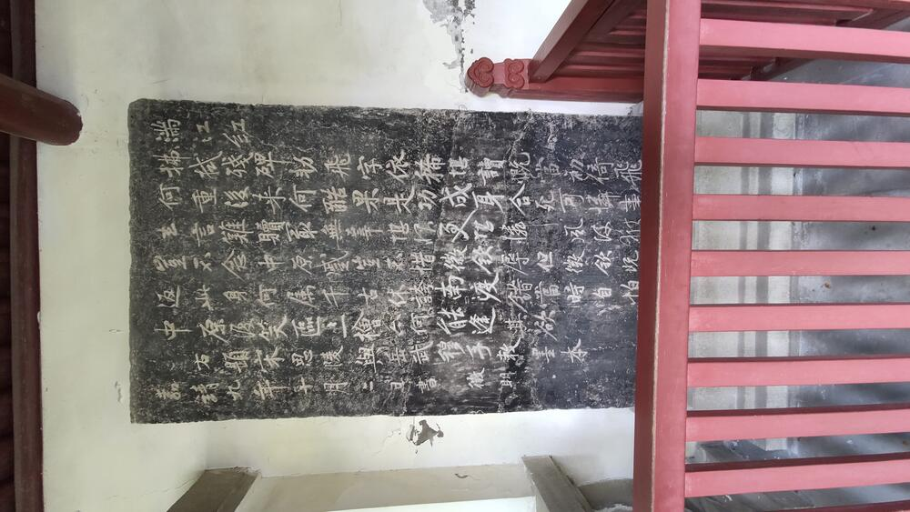
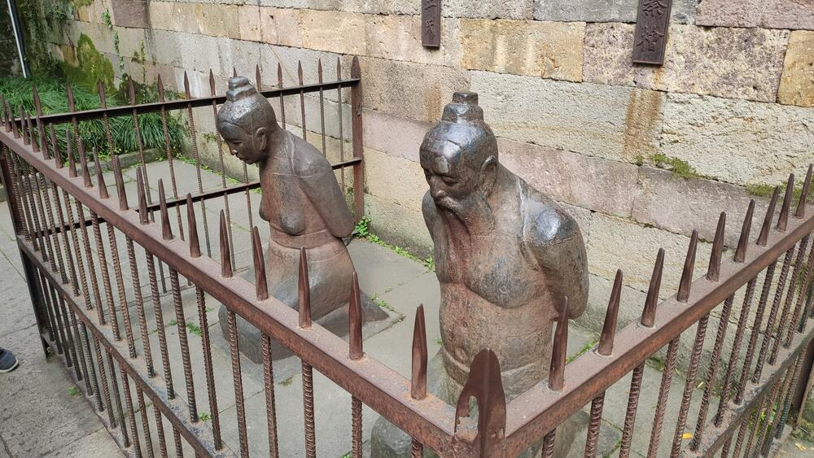
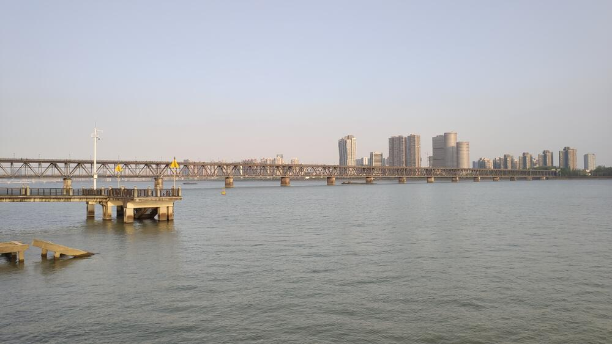

向来听闻西湖旁有岳王庙，但种种原因，苏堤断桥已是游玩数次，却从未迈进岳王庙的门槛。赶上清明，难得无事，便前去拜谒。

从凤起路站下地铁，沿湖北侧向西。期间经过断桥，果然人声鼎沸、喧闹不堪，令人望而却步。以往游西湖，十分匆忙，今日细看地图，才发现前方有“西泠印社”，这几个字十分眼熟。想了半天，原来是初中时无心学习，整日看乱七八糟的小说，西泠印社便是《盗墓笔记》中男主店铺的所在。

约有三十分钟，就到了岳王庙门口。出乎意料，来的人并不是很多，与此时的断桥、苏堤相比，更是少的可怜。门前游客，叽叽喳喳，都在与庙门合影，人虽不多，也显得十分热闹。

在手机上买好二十五元的门票，便进了庙门。原以为清明的岳王庙，应是香火鼎盛，上前一瞧，那香炉却干净的一尘不染，想必是环保需要，以花代香，也算是新风尚了。

左右两殿，供着牛皋、张宪二员猛将。回想小时顽皮，半夜不眠，偷看小说，就有《说岳全传》。其中牛皋、张宪两位，事迹众多，也不知几分真、几分假。《说岳全传》中，牛皋与金兀术同归于尽，而张宪先前已与岳家父子一起遇害了。每每想来，只恨奸臣误国、昏君无能。

再往前，便是正殿，门上有“心昭天日”横匾，取自“天日昭昭，天日昭昭”。正殿之上，岳少保端坐中央，无比威严。大殿两侧，绘有岳飞事迹；名人题字，更是数不胜数。正在观览时，听见一位母亲训斥孩子：“你闹着要来，现在又不好好看！”，不禁莞尔。人年幼时，出游也好，读诗也罢，往往三分钟热度，并不知其中深意。待日后想起，方才有所感触。

出了大殿，向右有一庭园，两侧都是碑廊。入口处碑上有满江红词，是明代文徵明的书法。再向前去，更有乾隆皇帝的御笔。忽然想到，金兀术与弘历，也都算是女真一族。不知皇帝来杭州拜岳庙时作何感想。

穿过门洞，前方就是岳家父子的墓了。墓前，便是臭名昭著的秦桧、王氏、万俟卨、张俊四个奸人的铁像。铁像皆跪姿，神色戚戚，四周围有铁牢，还有“文明游览，请勿吐痰”字样，猜测是管理方的保护措施。来往的游客，对着铁像指指点点，不过未见有拳打脚踢者。仔细看介绍，才知道原先的铁像已于十年动乱中遗失，如今的铁像是重铸的。希望下次重铸时，能有“完颜构”像，毕竟奸臣昏君，难分高下，只是不知岳爷爷是否同意。再看墓前，鲜花簇簇，心中一暖。英雄永远为后人所纪念，坏人永远为后人所唾弃。

离开岳王庙，继续向西，发现此处离玉泉校区不远。几个月后，自己也要搬来玉泉了，只是不知那时，是否还有这样的闲情逸致。

时辰尚早，便乘 318 路南去，看看钱塘江大桥。钱塘江大桥是中国第一座现代化的桥梁，此时江水滔滔，铁桥巍然，好不壮观。但想起今日所见，心中却有些悲凉。当年，茅以升先生就是在这里，为了阻碍日军南下，亲手炸断了自己设计的大桥。

然而，一座断桥，又如何抵挡帝国主义的铁蹄！即使如岳飞般英勇善战，也敌不过奸臣昏君，终究含冤而死。再想想自己，上不能穷宇宙之奥，下不能平家国之恨，既无体魄，又乏知识，昏昏度日，一事无成，与岳将军、茅先生去之甚远。他们尚且无能为力，我又如何是好？

此处略去两百字。

清明谒岳王庙、观钱塘江大桥，有所感怀，以流水账记之，与诸君共勉。